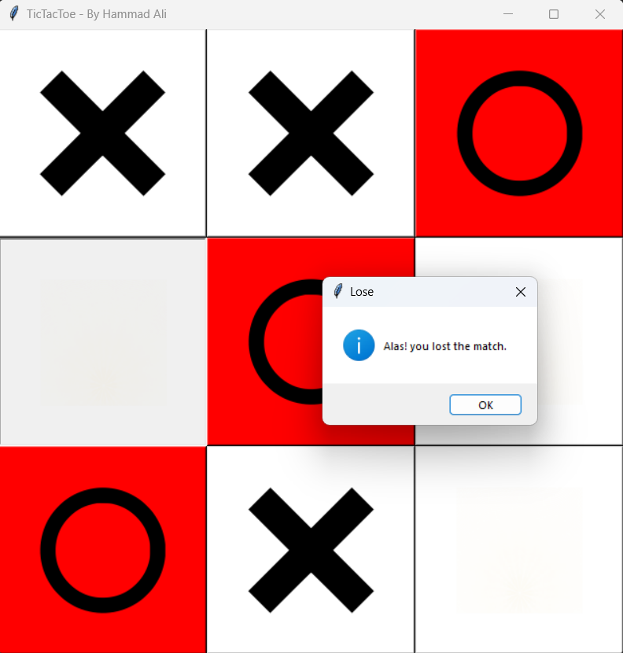

# Tic-Tac-Toe Game

Tic-Tac-Toe is a classic two-player game in which players take turns marking a 3x3 grid with their symbols (usually "X" and "O") with the goal of being the first to form a horizontal, vertical, or diagonal line of their symbols. This is a Python implementation of the game using the Tkinter library for the graphical user interface.



## Features

- **Player vs. Computer:** Play against an opponent that makes smart moves based on your moves.

- **Winning Logic:** The game includes logic to determine the winner and highlight the winning combination of cells.

- **Tie Game:** If the board is filled with no winner, the game declares a tie.

## Requirements

To run this game, you need:

- Python 3.x
- Tkinter (usually included with Python)

## How to Run

1. Clone or download this repository to your local machine.

2. Open your terminal or command prompt and navigate to the project directory.

3. Run the game using the following command:

   ```
   python main.py
   ```

4. Enjoy playing Tic-Tac-Toe!

## How to Play

- Click on any empty cell to make your move (you play as "X").

- The computer will play as "O" and make its move automatically.

- The game will announce the winner or declare a tie when the game is over.

- You can choose to quit the game at any time.

## Game Logic

The game implements a basic AI opponent with a set of rules to make smart moves based on the current game state.

## Author

This Tic-Tac-Toe game was created by [Hammad Ali](https://github.com/hammadali1805).
